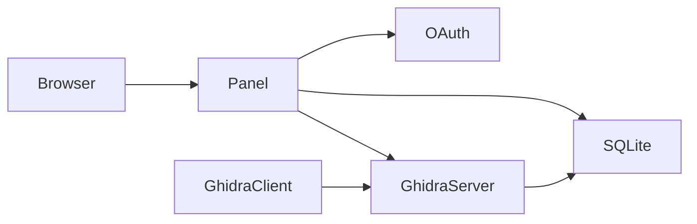

# Ghidra Community Panel

Self-service web panel for collaborative Ghidra reverse engineering projects.

**Features:** OAuth login (Discord/GitHub/Google/GitLab/OIDC), pseudonymous usernames, auto-generated credentials, repository management, audit logging, IP geolocation.


## Quick Start

**Method 1: Docker (Recommended)**
The easiest way to stand up both the Web Panel and the Ghidra Server is to use the included Docker Compose stack. Releases are automatically published to the GitHub Container Registry.

```bash
# 1. Download the template config
curl -O https://raw.githubusercontent.com/alandtse/ghidra-panel/main/config.example.yaml
mv config.example.yaml config.yaml

# 2. Edit config.yaml with your OAuth credentials!

# 3. Start the server using the compiled stack
docker compose -f https://raw.githubusercontent.com/alandtse/ghidra-panel/main/docker-compose.prod.yml up -d
```
See [Administrator Operations Guide](./ADMIN_GUIDE.md) for more details.

**Method 2: Manual / Dev Build**
```bash
make build jaas                    # Build panel + JAAS plugin
cp config.example.yaml config.yaml # Configure OAuth credentials
cd jaas && make install            # Install to Ghidra Server
./srepanel/srepanel -config config.yaml -db panel.db
```

Visit `http://localhost:8080`

## Configuration

**Environment Variables Support**:
All attributes in the `config.yaml` file can be overridden at runtime using environment variables prefixed with `SRE_`. For example, `base_url` becomes `SRE_BASE_URL` and `community_name` becomes `SRE_COMMUNITY_NAME`.

**Minimal setup** - Add OAuth credentials to `config.yaml`:

```yaml
base_url: "http://localhost:8080"

oauth:
  discord:
    enabled: true
    client_id: "your_client_id"
    client_secret: "your_client_secret"
```

Create OAuth app with redirect URI: `{base_url}/redirect`

**Provider setup:**
- [Discord](https://discord.com/developers/applications)
- [GitHub](https://github.com/settings/developers)
- [Google](https://console.cloud.google.com/)
- [GitLab](https://gitlab.com/-/profile/applications)
- Any OIDC provider (see `config.example.yaml`)

**Optional:**
- `first_user_is_admin: true` - First login becomes super admin
- `maxmind_account_id` / `license_key` - IP geolocation ([setup](./GEOIP_SETUP.md))
- `audit_log_retention_days: 365` - Log retention period
- `community_name: "Your Team"` - Custom branding

See [`config.example.yaml`](./config.example.yaml) for all options.

## Ghidra Server Setup

**Required:** Install JAAS plugin on Ghidra Server for authentication.

```bash
cd jaas && make build install
```

See [GHIDRA_SERVER_SETUP.md](./GHIDRA_SERVER_SETUP.md) for manual installation and troubleshooting.

## User Flow

1. **Login** via OAuth → Credentials auto-generated
   - Username: `alice_8f3a2b` (pseudonymous)
   - Password: `alpine-rocket-marble-sunset` (Diceware)
2. **Save credentials** to password manager (export to 1Password/Bitwarden/etc.)
3. **Connect Ghidra** → Shared Project → Use credentials

**Features:**
- Request repository access
- Regenerate password anytime
- Admin dashboard (stats, audit logs, user management)
- IP geolocation tracking (optional)

## Development

```bash
make dev        # Dev mode (bypasses OAuth)
make dev-clean  # Fresh database
make help       # Show all commands
```

**Test real OAuth:** Add credentials to `config.yaml`, run without `-dev` flag.

## Architecture



- **Panel** (Go) - Web UI, OAuth, user management
- **JAAS Plugin** (Java) - Ghidra authentication
- **gRPC** - Panel ↔ Ghidra communication
- **SQLite** - Credentials, audit logs

## Philosophy

Built for hobbyist communities with limited maintenance time:
- Minimal dependencies (no external DB/IdP)
- Battle-tested libraries (oauth2, OIDC, SQLite)
- Server-side rendering (simple, fast)
- Single binary deployment

## Documentation

### For Administrators (Deployment & Support)
- [Administrator Operations Guide (Docker Setup & Maintenance)](./DOCKER_SETUP.md)
- [GHIDRA_SERVER_SETUP.md](./GHIDRA_SERVER_SETUP.md) - Manual Ghidra Server installation
- [GEOIP_SETUP.md](./GEOIP_SETUP.md) - IP geolocation configuration
- [config.example.yaml](./config.example.yaml) - Full configuration reference

### For Developers (Contributors)
- [Testing Guide](./TESTING.md) - How to run test suites (local or via Docker)

## Acknowledgements

Powers [decomp.dev](https://decomp.dev) - GC/Wii decompilation projects.

Original project by [mkw.re](https://github.com/mkw-re) contributors.
